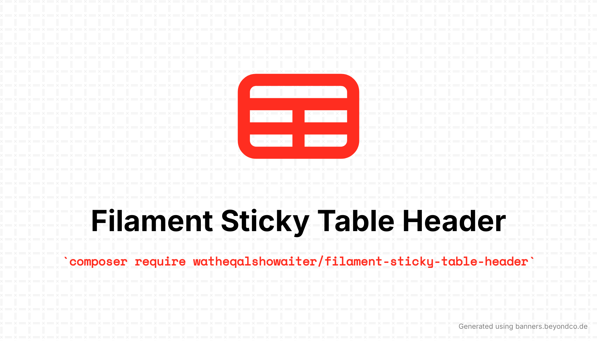
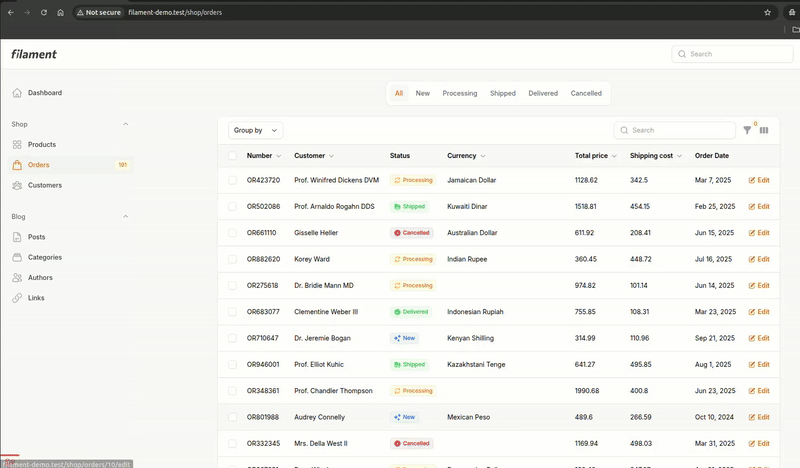

# Filament Sticky Table Header

<!-- shields -->
[![Filament 3][ico-filament3]][link-packagist]
[![Filament 4][ico-filament4]][link-packagist]
[![Required Laravel Version][ico-laravel]][link-packagist]
[![Required PHP Version][ico-php]][link-packagist]
[![Latest Version on Packagist][ico-version]][link-packagist]
![GitHub Tests For Filament Versions Action Status][ico-tests-for-filament-versions]
![GitHub Code Style Action Status][ico-code-style]
[![Total Downloads][ico-downloads]][link-downloads]
![GitHub Stars][ico-github-stars]
[![StandWithPalestine][ico-palestine]][link-palestine]

[ico-filament3]: https://img.shields.io/badge/Filament-3.x-F2911B?style=flat-square

[ico-filament4]: https://img.shields.io/badge/Filament-4.x-F2911B?style=flat-square

[ico-laravel]: https://img.shields.io/badge/Laravel-%E2%89%A510-ff2d20?style=flat-square&logo=laravel

[ico-php]: https://img.shields.io/packagist/dependency-v/watheqalshowaiter/filament-sticky-table-header/php.svg?color=%238892BF&logo=php&style=flat-square

[ico-version]: https://img.shields.io/packagist/v/watheqalshowaiter/filament-sticky-table-header.svg?style=flat-square

[ico-downloads]: https://img.shields.io/packagist/dt/watheqalshowaiter/filament-sticky-table-header.svg?style=flat-square&color=%23007ec6

[ico-code-style]: https://img.shields.io/github/actions/workflow/status/watheqalshowaiter/filament-sticky-table-header/fix-php-code-style-issues.yml?branch=main&label=code%20style&style=flat-square

[ico-tests-for-filament-versions]: https://img.shields.io/github/actions/workflow/status/watheqalshowaiter/filament-sticky-table-header/run-tests.yml?branch=main&label=filament%20version%20tests&style=flat-square

[ico-github-stars]: https://img.shields.io/github/stars/watheqalshowaiter/filament-sticky-table-header?style=flat-square

[ico-palestine]: https://raw.githubusercontent.com/TheBSD/StandWithPalestine/main/badges/StandWithPalestine.svg

[link-packagist]: https://packagist.org/packages/watheqalshowaiter/filament-sticky-table-header

[link-downloads]: https://packagist.org/packages/watheqalshowaiter/filament-sticky-table-header/stats

[link-palestine]: https://github.com/TheBSD/StandWithPalestine/blob/main/docs/README.md

<!-- ./shields -->

A Filament plugin that makes table headers stick when scrolling down for better UX.

## Demo



## Installation

You can install the package via composer:

```bash
composer require watheqalshowaiter/filament-sticky-table-header
```

## Usage

Register the plugin in your Panel provider:

```php
use WatheqAlshowaiter\FilamentStickyTableHeader\StickyTableHeaderPlugin;

public function panel(Panel $panel): Panel
{
    return $panel
        ->plugins([
            // Other plugins...
            StickyTableHeaderPlugin::make(),
        ]);
}
```
You may need to run this command to publish assets

```sh
php artisan filament:assets
```

That's it! Your table headers will now stick to the top when scrolling.

## Features

✅ Supports Laravel versions: 12, 11, and 10.

✅ Supports PHP versions: 8.4, 8.3, 8.2, and 8.1.

✅ Supports Filament versions: 4.x and 3.x.

✅ Fully tested with PHPUnit with 100% code coverage.

✅ Full GitHub Action CI pipeline to format code and test against Filament versions: 4.x and 3.x.

## Testing

```bash
composer test
```

## Changelog

Please see [CHANGELOG](CHANGELOG.md) for more information on what has changed recently.

## Contributing

If you have any ideas or suggestions to improve it or fix bugs, your contribution is welcome.

I encourage you to look at [Issues](https://github.com/watheqalshowaiter/filament-sticky-table-header/issues) which are the
most important features that need to be added.

If you have something different, submit an issue first to discuss or report a bug, then do a pull request.

## Security Vulnerabilities

If you find any security vulnerabilities don't hesitate to contact me at `watheqalshowaiter[at]gmail[dot]com` to fix
them.

## Related Packages

- **[Model Fields](https://github.com/WatheqAlshowaiter/model-fields)** - Quickly retrieve required, nullable, and default fields for any Laravel model.
- **[Backup Tables](https://github.com/WatheqAlshowaiter/backup-tables)** - Backup single or multiple database tables with ease.

## Credits

- [Watheq Alshowaiter](https://github.com/WatheqAlshowaiter)
- [All Contributors](https://github.com/WatheqAlshowaiter/filament-sticky-table-header/graphs/contributors)

## License

The MIT License (MIT). Please see [License File](LICENSE.md) for more information.
